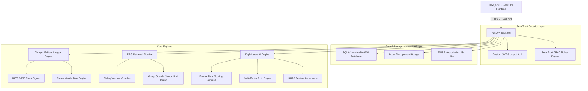

# Nyaya-ZTA System Architecture

## Database Schema (Clean Architecture Abstraction)
All database interactions use SQLAlchemy 2.x Repository Pattern over SQLite3 (`aiosqlite`). Switching to PostgreSQL requires changing `DATABASE_URL` in `.env`.
